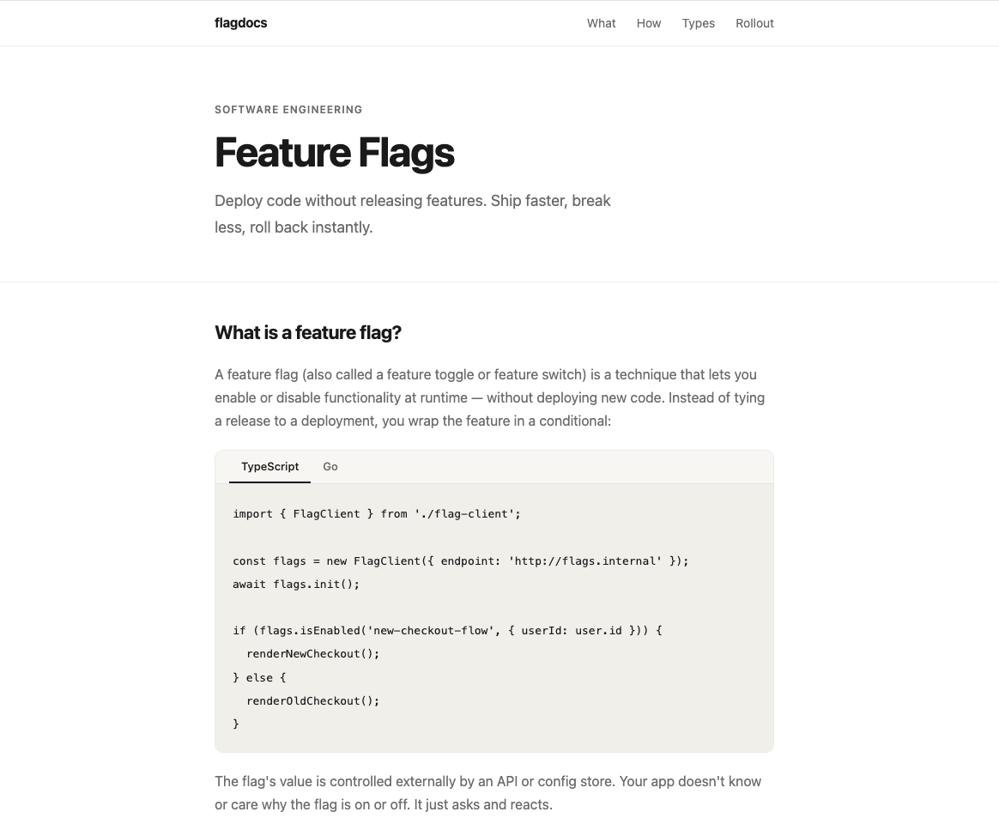
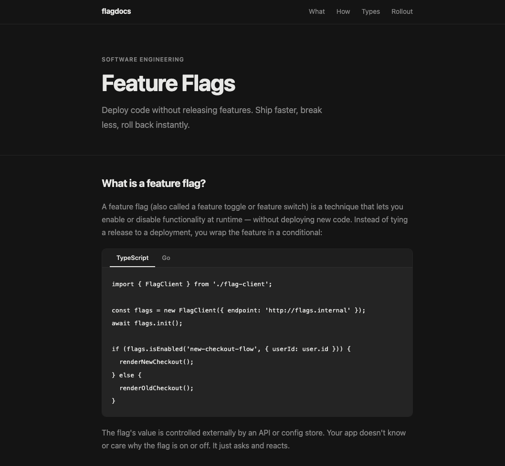
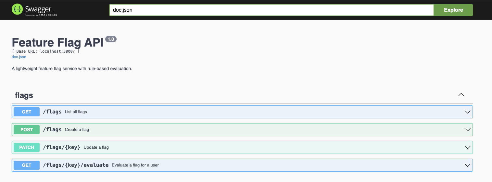

# Feature Flag Service

A lightweight feature flag API with rule-based evaluation (override lists, segment targeting, and sticky percentage rollouts), plus a static docs site that demos it in light/dark mode via a live flag.

See [DESIGN.md](DESIGN.md) for architecture and evaluation-engine details.

## Screenshots

| Light mode (flag off) | Dark mode (flag on) |
| --- | --- |
|  |  |

Swagger UI:



## Project layout

```
api/    Go API (sqlite-backed flag store, evaluation engine, swagger docs)
app/    Static docs site that reads the dark-mode flag and toggles its theme
docker-compose.yml
```

## Running it

```bash
docker-compose up --build
```

- API: http://localhost:3000 (Swagger UI at `/swagger/index.html`)
- App: http://localhost:8080

Flags are persisted to a sqlite file at `api/data/flags.db` (created automatically on first run). A `dark-mode` flag is seeded on startup if it doesn't already exist, so the API is usable immediately without any setup.

## API quick reference

| Method | Path | Description |
| --- | --- | --- |
| `GET` | `/flags` | List all flags |
| `POST` | `/flags` | Create a flag |
| `PATCH` | `/flags/{key}` | Update a flag's `isEnabled`/`rules`/`description` |
| `GET` | `/flags/{key}/evaluate?userId=...` | Evaluate a flag for a user |

Example — roll a flag out to 100% of users:

```bash
curl -X PATCH http://localhost:3000/flags/dark-mode \
  -H "Content-Type: application/json" \
  -d '{ "isEnabled": true, "rules": [{ "type": "percentage", "rollout": 100 }] }'

curl "http://localhost:3000/flags/dark-mode/evaluate?userId=user_942"
```
